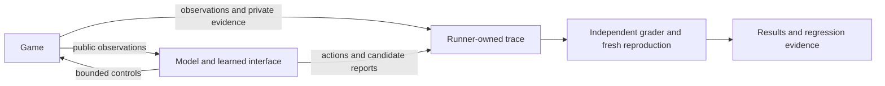

# Grey Box: playtesting vision and model evaluation design

Status: proposed design, 2026-09-05. The user has set the long-term goal of
playtesting any game and evaluating models through that work. This document
defines how to pursue and measure it. [agent.md](agent.md) remains the authority
for the implemented v1 architecture; future interfaces described here are not
available CLI features.

## Product goal and evaluation question

The product should take a game build and a testing objective, learn how to
interact with it, explore meaningful behaviors, and deliver defects with evidence
that another tester can reproduce. It should preserve useful interfaces and
regression scenarios across authorized testing sessions.

The evaluation asks: **under a declared observation interface and resource
budget, how effectively can a model learn an unfamiliar environment, exercise
its behavior, and produce trustworthy findings?** The unit being evaluated is
a model plus a versioned agent harness. Scores cannot isolate model capability
from prompts, memory, tools, perception, and runtime without controlled comparisons.

Game-playing ability and playtesting ability are separate outcomes. A player
may finish quickly while missing every defect. A tester may find a serious
defect without finishing. Adapter quality is a third outcome: successful code
generation does not establish good play or good diagnosis.

V1 supports one controlled text game, fixed invariant candidates, recorded
execution, independent verification, and optional parser generation/repair.
Live acceptance and comparative results remain pending. The two public planted
bugs are development fixtures, not a hidden benchmark or evidence of generality.

## Reaching games beyond v1

Broad access and trustworthy grading are different integration problems. Screen
capture and keyboard/mouse control offer a common interaction surface; SIMA
demonstrated this approach across multiple 3D environments. It does not establish
that arbitrary games need no setup or that their bugs can be graded automatically.
See the [SIMA research report summary](https://deepmind.google/blog/sima-generalist-ai-agent-for-3d-virtual-environments/).

Each future game integration must declare three boundaries:

| Boundary | Responsibility | Visible to the evaluated agent? |
| --- | --- | --- |
| Game connection | Launch, reset or restore, capture text/images/audio, send permitted controls, and timestamp events. | Public observations and control primitives only. |
| Learned interface | Convert public observations into an explicit representation; later support learned action routines. | Yes; versioned and charged to the run. |
| Grader | Evaluate objectives, inspect permitted internal evidence, validate findings, and reproduce failures. | Its rules/evidence stay private except for the public task specification. |

There is no grading-feedback path back into the evaluated trial. The runner owns
the trace and budgets; the player cannot write grading records or change its
remaining allowance.

The game connection may disclose how to send a line or hold a key. It must not
silently supply a winning path, hidden state, or legal semantic action list.
If public manuals, tutorials, or a hand-written parser are supplied, label that
as a separate assisted condition. Source-assisted testing can be a useful later
track, with scores kept separate from public-interface discovery.

Replace the dungeon-specific HP/grid/inventory contract with a general observation
envelope before claiming support for arbitrary games. Preserve modality, timestamp,
raw evidence references, and provenance. Game-specific facts may be optional;
do not force every game into a dungeon schema. Generated parsers remain separate
from host controls and grading. Supporting macros or code that executes actions
will require a new bounded action contract; today's adapter only parses.

For real-time games, specify whether simulation pauses during inference, capture
frequency, frame skips, action duration, held-button release, and latency handling.
Score paused and real-time conditions separately. Cap simulated time and control
events as well as decisions: one long macro must not become unlimited free play.
Record opponents and server behavior when they affect the scenario. A game that
cannot restore a comparable starting state can support exploratory playtesting,
but should not enter the controlled ranking until its variability is characterized.

## Scenarios and task families

A scenario is a versioned game build, start state, public task, access condition,
budget, and independent grading rule. Freeze a manifest before evaluation:

- Game/build hash, game family, split, scenario ID, seed or snapshot, reset method,
  and grading version; private fault identity and reference reproduction if applicable.
- Exact task wording, discoverable help, modalities, control primitives, timing
  policy, permitted tools, and network/file-access restrictions.
- Model/provider/version, prompt hashes, decoding and reasoning settings, context
  policy, helper models, adapter condition, and initial memory/artifact hashes.
- Decision, input, simulation-time, wall-time, and model-spending limits; retry,
  failure, replication, and exclusion rules.

Use a stable public task across clean/faulty variants so wording does not reveal
whether a bug exists. Never give the player the private fault identity or trigger.
Normal intended behavior must be inferable from public evidence or a legitimate
task specification. A secret rule the agent could not infer tests guessing.

| Task family | Example | Primary evidence |
| --- | --- | --- |
| Interface discovery | Use an unfamiliar control scheme with usable in-game clues. | Correct completion of a small interaction; attempts/time to completion. |
| Planning and memory | Retrieve an object behind several prerequisites. | Independent terminal predicate and predeclared intermediate milestones. |
| Exploration and testing | Investigate mechanics and report suspected defects. | Unique reachable faults exposed, report precision, and confirmed reproductions. |
| Recovery | Continue after a parser-breaking format change or an unsuccessful action. | Task recovery, validated replacement parser, and bounded overhead. |
| Transfer | Play a new level or a game from a held-out family. | The same metrics, with the exact transfer condition identified. |

Include full episodes and short diagnostic scenarios from controlled checkpoints.
The latter can show whether a model can handle a mechanic once it reaches it;
report these separately so removing exploration difficulty does not inflate an
end-to-end score. This use of repeatable continuations is informed by the
[Standardised Test Suite](https://arxiv.org/abs/2205.13274), which evaluates agent
continuations from curated interaction contexts.

For example, a future item-system scenario could ask the player to test item
interactions and report unexpected behavior. A private manifest selects a clean
or faulty build, with a known reachable trigger. Reaching an invalid state earns
fault-discovery credit; submitting an accurate evidence-backed report earns
reporting credit; independently reproducing it earns reproduction credit. Merely
printing a high score earns none of those. A separate gameplay task on the same
mechanic checks the intended objective. This is a grading example using a known
mechanic, not a proposed hidden test based on v1's already public bugs.

## What gets compared

Start with the smallest comparison that identifies a cause:

| Experiment | Change | Hold fixed | Interpretation |
| --- | --- | --- | --- |
| Policy comparison | Policy model. | Raw interface, prompts, tools, history policy, scenarios, and budgets. | Model performance within this harness. |
| Adapter comparison | Raw, first adapter frozen, or bounded repair. | Policy and author model/settings, tasks, corpus rules, and budgets. | Effect of the adapter system. |
| Authoring diagnostic | Adapter-author model. | Public development transcripts and withheld evaluation corpus. | Interface synthesis quality independent of exploration. |
| Complete-agent comparison | Policy plus its own authoring model. | Outer access, scenarios, and budgets. | Performance of the declared complete system. |

For adapter conditions, use identical initial synthesis settings in frozen and
repair modes. Report candidate rejection and synthesis failure as outcomes. To
isolate repair more tightly, a separate diagnostic can start both conditions
from the same immutable adapter and apply the same interface change.

When evaluating the effect of a changed component, the rest of the harness must
stay frozen. Sharing a fixed helper model can support policy comparisons; using
the candidate model for both roles supports complete-agent comparisons. Name
the choice and charge all helper calls. Never compare an assisted visual model
against an unassisted one as though only their policy models differed.

Useful baselines are a random low-level actor, a simple exploration heuristic,
the raw model agent, and frozen/repair variants. A legal-action-aware random
actor or hand-written semantic parser is an explicitly assisted diagnostic.
Reference scripts establish task solvability and fault reachability; they are
not discoveries and never enter player context.

## Independent grading and defect evidence

V1's fixed checker detects numeric invariant violations from interpreted state.
Its verifier independently reproduces observations and evaluates game state.
This measures whether the policy reaches a violation and whether its observation
supports the checker. `policy_candidate` describes this evidence path; it does
not mean the model independently invented the invariant or diagnosed a root cause.
Keep `oracle_scan` findings, first detected by the offline grader, separate.

Open-ended testing needs a future structured report channel: suspected behavior,
expected behavior and its public basis, observation/action references, and a
reproduction proposal. The evaluated model submits claims; it does not decide
their truth. Build-specific rules, differential checks, and blinded human review
can grade them. An LLM may assist triage but must not be the sole authority for
the headline bug count. Human decisions need a rubric, disagreement resolution,
and model identities hidden from reviewers.

Build a controlled fault suite from reviewed buggy/fixed pairs. Each scored fault
needs a known trigger reachable under the chosen access and budget, a reference
reproduction, and evidence that the matched fixed build does not violate the
same rule. Start with one fault per variant to make attribution clear, then add
interaction faults. Keep the original v1 planted bugs intact; later clean/faulty
variants belong in separate versioned fixtures. Remove fault labels from public
paths, banners, build metadata, and scenario descriptions.

After a run, the grader determines:

1. Whether an action sequence actually reached a fault.
2. Whether the agent reported it accurately, if report generation was enabled.
3. Whether a fresh reproduction supports the finding under the declared method.
4. Which independently adjudicated defect it belongs to, so repeated triggers
   and paraphrased reports count once.

Unique defects are counted by reviewed fault/root-cause identity where available.
Different visible symptoms are not automatically different bugs. Retain rejected
and unresolved claims. Unexpected real defects outside a seeded catalog can be
valuable, but need separate adjudication and must not silently change the frozen
recall denominator. Add them to a later suite release after review.

For unfamiliar commercial games, correctness may require a developer's intended
behavior or a reviewed public specification. "HP exceeds max HP" is meaningful
in this v1 target, not a universal rule. Fun, frustration, and balance are human
review topics; an agent's opinion is not a confirmed functional defect.

Validate the graders before model ranking. Reference success and failure traces,
clean/faulty pairs, fabricated reports, corrupt observations, duplicate claims,
and constant parsers should produce the expected outcomes. Grade game success
from the intended task predicate, not a mutable displayed score or a model's
assertion of victory. If exploiting a defect can satisfy the terminal flag while
violating the task, define that distinction in the public task and private grader
before the run; the defect may earn testing credit without gameplay credit.
Adjudicate suspected grader errors before a release and re-score every affected
model under the same corrected version. Record human integration and grading
effort separately from inference cost, since reducing per-game setup is itself
part of the product goal.

## Reproduction has levels

| Evidence class | Required record | What can be claimed |
| --- | --- | --- |
| Exact | Same deterministic build/runtime/start and input sequence; byte and exit comparison. | Exact reproduction, as in v1. |
| Controlled semantic | Snapshot/build, timed inputs, observation log, and an independent failure predicate despite harmless visual variation. | Reproduced behavior under specified controls. |
| Statistical | Repeated fresh attempts, declared reset/control method, predicate, successes/attempts, and uncertainty. | Observed reproduction frequency under those conditions. |

Predeclare reproduction attempts and acceptance criteria per scenario; do not
retry until one succeeds and omit the failures. A seed alone does not guarantee
determinism in a networked or real-time game. Store video, logs, timestamps, and
save-state identities as needed. Minimize reproductions only after confirming
the original trace, and validate the reduced trace afresh. V1 does not implement
statistical reproduction, visual capture, or trace minimization.

## Scorecard and failure accounting

Publish component metrics with denominators; do not launch with a single opaque
"intelligence" score.

| Metric | Definition and limit |
| --- | --- |
| Task success | Independently successful scheduled trials / scheduled trials, with failures labeled. Also report conditional results over valid completed evaluations. |
| Progress | Fraction of predeclared milestones reached; publish per game before any normalized aggregate. |
| Fault discovery | Per scenario, distinct catalog faults reached / catalog faults certified reachable from that start within its budget; also report unique faults across the suite. |
| Report precision | Confirmed distinct claims / adjudicated distinct claims, with unresolved claims and adjudication coverage shown separately. No submitted claims means precision is undefined. |
| Clean-control false alarms | Clean trials with at least one submitted bug claim / evaluated clean trials; show confirmed versus rejected or unresolved claims. |
| Reproduction success | Successful fresh attempts / scheduled reproduction attempts, by evidence class, with infrastructure failures identified. |
| Observable-state accuracy | Correct fields / eligible fields in a fixed withheld corpus, plus unknown, incorrect, missing, and execution-failure counts. |
| Coverage | Predeclared reachable mechanics, transitions, or instrumented code reached; never equate visited squares with whole-game coverage. |
| Efficiency | Verified outcomes and unique faults against cumulative actions, simulated time, wall time, and accounted cost; include acquisition and repair. |
| Reliability | Completion, provider error, invalid output, timeout, isolation failure, and harness failure rates. |

For parser diagnostics, schema-valid acceptance and semantic correctness remain
separate. Count hard parser failures in full-observation correctness; do not
report only fields returned by successful parsers. Ground truth describes what
the public observation supports, including retained and unknown facts, rather
than asking the agent to reconstruct hidden state.

For known-fault recall, determine the opportunity set before evaluation using
the reference solution, not the trajectory the tested model happened to take.
For uncontrolled games the total bug population is unknown: report verified
yield and coverage proxies, not invented recall. Time to first fault must include
the fraction of runs that never find one; success-only averages are misleading.

Use a common decision/context policy and environment budget for capability
comparisons. Tokenizers and reasoning controls differ, so identical token counts
do not imply identical compute or cost. Publish native usage and settings.
Evaluate economic efficiency separately at predeclared spending tiers, using
dated prices and including policy, authoring, repair, retry, and helper costs.
Unknown usage stays unknown; report incomplete accounting rather than a precise
cost ratio. Report cost/performance curves before claiming an adapter saves money.

Include every scheduled attempt in the reliability/accounting ledger. Publish
operational success over all scheduled trials and capability results conditional
on valid evaluations side by side. Classify verified harness/infrastructure
failures separately from model decisions. Define any replacement run policy
before starting; retain original failures and costs. During a provider outage,
pause a predeclared comparison block rather than selectively rerunning the
weaker-looking model. Never retry an unknown-usage call automatically.

## Generalization, memory, and leakage

Use separate development and held-out evaluation partitions. New seeds measure
new instances of an existing game; they do not establish transfer to another
game. Procedural diversity is useful for this first distinction, as demonstrated
by [Procgen](https://proceedings.mlr.press/v119/cobbe20a.html).

Later releases should separate three transfer axes: unseen levels in a familiar
game, unseen presentation/control variants with public clues, and independently
built games or game families. Split by family and generator lineage where
possible; cosmetic reskins do not establish new-game transfer. Public game
knowledge may exist in model training, so "unseen by the harness" must not be
presented as proven unseen during pretraining. Private builds and novel reviewed
mechanics can reduce contamination but cannot prove its absence.

In the default episodic track, reset policy history, generated code, and memory
between trials. In a separate adaptation track, permit an equal, charged
development phase; freeze and hash the resulting artifacts, then evaluate
held-out scenarios from the same initial artifact snapshot each time. If online
repair is enabled, allow it within a held-out episode but discard those updates
before the next trial. A future continual-learning track must fix episode order
and report the whole learning curve rather than mixing it with independent trials.

Keep private seeds/fault identities, grading results, game source, and evaluator
instrumentation out of runtime and authoring prompts and subprocess mounts.
Generate development examples from public observations only. Review snapshots
and saved memory for answer leakage. Freeze benchmark releases; adding a new
defect or changing a grader creates a new version. A failure discovered in this
release may seed the next release after curation, not quietly alter this one's test.

## Repetitions and uncertainty

Pair starting scenarios across models, and repeat policy runs even at nominally
deterministic decoding. Randomize or interleave model order to reduce temporal
provider effects. A repeated run is not a new game or independent fault.

Publish results per game and family. Aggregate within each game first, then use
declared game/family weights so a game with many seeds cannot dominate. Report
paired differences with 95% uncertainty intervals, resampling at the relevant
scenario and game clusters rather than treating every frame as independent.
With few games, limit inference to those games; a bootstrap cannot manufacture
evidence of broad generalization. Predeclare the primary comparisons and avoid
ranking noise as progress. These choices follow the concern about uncertain
benchmark point estimates raised in [Statistical Precipice](https://arxiv.org/abs/2108.13264);
the specific Grey Box protocol here is a proposed design.

## Smallest useful evaluation campaign

Finish the existing live acceptance first. Then implement a manifest-driven
runner/report with another model client and schedule an exploratory pilot:

1. Compare two available policy models in raw mode on ten predetermined held-out
   seeds with three independent runs each: 60 episodes. Keep development seed 42
   outside that set. Publish the seed manifest after the campaign where suitable.
2. For one preselected model, compare raw/frozen/repair on those same seeds and
   repetitions: 90 condition-episodes. Reuse its 30 raw results only if all shared
   settings and the predeclared scheduling window match; otherwise rerun the block.
3. Score accepted adapters on a separate withheld transcript corpus containing
   normal, partial/error, and terminal observations. Use public-observation labels
   produced independently of the generated parser. Corpus authoring examples and
   grading answers must remain separate.
4. Publish all attempts, per-seed results, artifact/configuration hashes, uncertainty,
   verified findings, and usage completeness. Make no cross-game claim from this pilot.

These sample counts are a starting pilot design, not a power guarantee. Estimate
variance and meaningful effect sizes from development/pilot data, then freeze a
new adequately sized confirmatory campaign; do not repeatedly inspect test
results and keep extending it until a preferred model wins. The proposed campaign
is not authorized or launched by writing this document.

For the first cross-game pilot, add at least three independently built text games
with differing mechanics and reviewed clean/faulty variants, plus short planning
tasks. This is an integration gate, not sufficient evidence for "any game."
Preflight reproducibility, grade validity, reachability, and negative controls
before spending model calls. Keep the original public dungeon as a smoke test.

## Roadmap and acceptance gates

| Stage | Deliverable | Gate |
| --- | --- | --- |
| V1: controlled text prototype | Existing runtime, verified findings, generated parsers, bounded repair, and comparison report. | Complete live acceptance and publish the within-game evidence with costs and limits. |
| Multiple text games | General observation envelope, pluggable connections/graders, report submission, multiple clients, manifests, and clean/faulty suites. | Independent games run without hidden semantic assistance; grades pass positive/negative controls; pilot is reproducible. |
| Visual 2D | Screen capture, timed keyboard/controller input, snapshot reset, and semantic reproduction. | Perception diagnostics and complete playtest trials work under declared timing; no byte-replay claim for pixels. |
| Real-time 3D and broader genres | Audio where needed, long-session memory, controlled servers/opponents, and reproducible regression reports. | Per-game support and evidence contracts, reviewed real defects, and separate family/latency results. |

The proposed contribution is to combine learning the game interface, exercising
behavior, and validating reproductions in one inspectable system. Games as model
evaluations are established in [BALROG](https://arxiv.org/abs/2411.13543), and
[GBQA](https://arxiv.org/abs/2604.02648) already studies autonomous bug discovery
on games with human-verified defects. Grey Box should compare against relevant
existing work and demonstrate its particular combination before claiming novelty.
